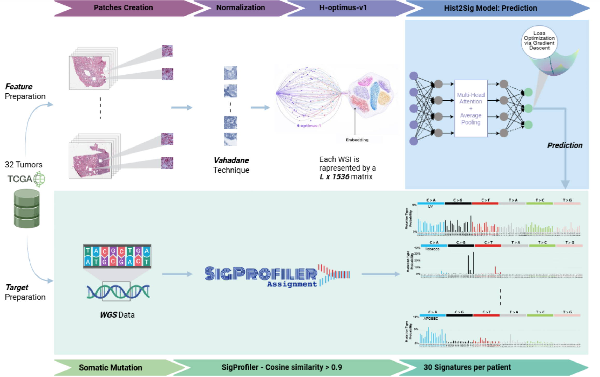

<p align="center">
  
</p>

<p align="center">
  <em>Predicting mutational signature exposures from H&amp;E whole-slide images</em><br>
  <sub>Figure rendered from <a href="assets/Hist2sig.pdf">Hist2sig.pdf</a> — open the PDF for the vector original.</sub>
</p>

<p align="center">
  
  
  
</p>

---

> ### ⚠️ Work in progress
>
> This repository is linked with this paper: https://arxiv.org/abs/2609.30985. The code, the
> documented pipeline and the released results are still changing: paths,
> command-line flags and file layouts may move without notice, and nothing here
> should be treated as a stable API yet. Results published from this repository
> should cite the specific commit used.

---

# Hist2Sig

Hist2Sig predicts exposures to 30 COSMIC SBS mutational signatures directly from
H&E-stained whole-slide images. It is trained on matched whole-genome sequencing
and histology from 29 TCGA tumor types, and benchmarked against a tumor-type-only
baseline to separate morphology-derived signal from tissue-of-origin priors.

This repository is meant for running the released model on new slides and for
reproducing the figures and metrics in the paper. It does not include the
training or hyperparameter-search code.

- **Model outputs and checkpoint** — see [`results/README.md`](results/README.md)
- **Paper metrics** — see [`Paper_reproducibility/`](Paper_reproducibility/)
- **Explainability** — see [`grad_cam_signatures/README.md`](grad_cam_signatures/README.md)
  and [`notebooks/`](notebooks/)

## Contents

1. [Setup](#setup)
2. [Preparing the WSIs](#preparing-the-wsis)
3. [Inference](#inference)
4. [Explainability](#explainability)
5. [Data availability](#data-availability)
6. [License](#license)

## Setup

Python **3.11.5** or newer is required. A plain `virtualenv` is recommended over
conda, though conda works too.

```bash
pip install -r requirements.txt
```

PyTorch is deliberately excluded from `requirements.txt` so that you can pick the
CUDA build matching your driver:

```bash
pip install torch torchvision torchaudio --index-url https://download.pytorch.org/whl/cu124
```

Two system libraries are also needed: **libvips** and **openslide**.

> **For developers:** the [`Dockerfile`](Dockerfile) pins a fully reproducible
> environment.

## Preparing the WSIs

### Flatten the download directory

The TCGA transfer tool downloads each slide into its own subfolder alongside a
log file. Move the `.svs` files up one level and drop the empty subfolders:

```bash
find dataset -name '*.svs' -exec mv {} dataset/ \;
find dataset -type d -empty -delete
```

### Step 1 — Slide check

```bash
python src/check_slide.py
```

Scans the input directory and writes a CSV with the metadata and properties of
each WSI, used to drive the resizing step. Slides that fail are logged under
`failed_WSI/` and their resolution is recorded as `N/A`.

### Step 2 — Resize

```bash
python src/resize_wsi_cpu.py
```

Resizes every WSI into `dataset_20x` (by default starting from 20x with a
downsample factor of 9) and optionally deletes the originals with
`--delete_original True`. Slides that fail are kept and logged in
`failed_wsi.txt`. The script uses all available CPU cores.

### Step 3 — Extract patches

```bash
python src/extract_patches.py
```

Adapted from **CLAM**. Check the dataset and result-directory flags at the top of
the script. It produces three subfolders: masked images (visualization only),
patches (`.h5` files with coordinates) and stitches (visualization of the tissue
actually retained).

### Step 4 — Extract features

H-optimus-1 is a gated model on Hugging Face: request access on its model page,
then authenticate with `huggingface-cli login` or by exporting `HF_TOKEN`.

```bash
python src/extract_features_no_norm_optimized.py \
    --source <dir with slides> \
    --h5 result_dir/patches \
    --features <features dir>
```

The longest step. Each patch is encoded with **H-optimus-1**, with no stain
normalization, which is how the features for the released model were produced.
The script writes one `.pt` file per slide with the format expected by the
inference and explainability scripts:

```python
{"feat": Tensor[n_patches, 1536], "coords": Tensor[n_patches, 2]}
```

## Inference

Predict exposures for every `.pt` feature file in a directory with the released
checkpoint:

```bash
python src/predict_activities_nb.py \
    --features <dir> \
    --ckpt checkpoints/hist2sig.pt \
    --out_csv predictions.csv
```

The feature files are the ones written by Step 4. The output
CSV has one row per slide (`Image ID`, `Case ID`) and one column per signature.
Bag size and patch sampling default to the settings stored in the checkpoint.
Add `--cuda cpu` to run without a GPU.

`checkpoints/hist2sig.pt` is a refit on the full TCGA training set
(train + validation combined) and is the checkpoint to use for new or external
data.

## Explainability

Per-signature patch attribution (the MIL analogue of Grad-CAM: patch embedding ×
gradient, weighted by the model's attention) is computed by:

```bash
python grad_cam_signatures/export_signature_patch_attribution.py
```

See [`grad_cam_signatures/README.md`](grad_cam_signatures/README.md) for the
method, and the `notebooks/xai_*.ipynb` series for the downstream analyses:
ranking specificity, importance mass, decodability in feature space, and the
patch visualizations used in the manuscript figures.

## Data availability

The ground-truth signature exposures and 96-channel mutational profiles were
derived from controlled-access whole-genome sequencing and are therefore **not
included** in this repository. Researchers with dbGaP authorization for TCGA
([phs000178](https://www.ncbi.nlm.nih.gov/projects/gap/cgi-bin/study.cgi?study_id=phs000178))
and CPTAC
([phs001287](https://www.ncbi.nlm.nih.gov/projects/gap/cgi-bin/study.cgi?study_id=phs001287))
can regenerate them and place them at the paths listed in `.gitignore` to run
the evaluation in [`Paper_reproducibility/`](Paper_reproducibility/).

The repository does include model predictions only (no ground truth), the fold
assignments in `splits/folds.csv`, and the COSMIC v3.4 reference signatures.

The whole-slide images are publicly available from the
[GDC](https://portal.gdc.cancer.gov/) (TCGA) and from
[TCIA](https://www.cancerimagingarchive.net/) (CPTAC). The results shown here
are in whole or part based upon data generated by the TCGA Research Network:
https://www.cancer.gov/tcga. Data used in this publication were generated by
the National Cancer Institute Clinical Proteomic Tumor Analysis Consortium
(CPTAC).

## License

- **Code**: [MIT](LICENSE).
- **Model weights** (`checkpoints/hist2sig.pt`):
  [CC BY-NC 4.0](checkpoints/LICENSE), for non-commercial research use only.
  The weights are trained on
  [H-optimus-1](https://huggingface.co/bioptimus/H-optimus-1) features, so its
  CC BY-NC-ND 4.0 terms also apply: request access to H-optimus-1 separately
  and cite it alongside Hist2Sig.

Hist2Sig is a research tool and is not intended for clinical or diagnostic use.
